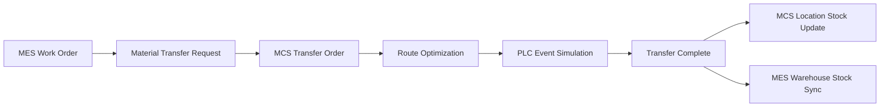

# MES/MCS Integration Plan

## Purpose

MES and MCS are separate systems, but they must be connected by an operational flow that is easy to explain in a demo.

- MES decides what must be produced, received, shipped, or tracked.
- MCS controls where material is located and how it moves between locations.
- PLC events simulate equipment/route status changes during MCS movement.

## Current Connection

| Area | Current State |
|---|---|
| Database | MES and MCS use the same `MES_DB` database. |
| Master data | MCS reads MES master tables such as `MST_PLANT`, `MST_WAREHOUSE`, `MST_ITEM`, and `MST_VENDOR`. |
| Inventory | MCS transfer completion updates MCS location stock and synchronizes MES warehouse stock when the warehouse changes. |
| Route | MCS transfer orders can calculate and store optimized movement routes. |
| PLC | PLC simulator can update transfer progress and route edge status. |

## Target Demo Flow

## Implementation Phases

| Priority | Feature | Result |
|---|---|---|
| 1 | MES work order requests MCS material transfer | Work order becomes the business reason for an MCS transfer order. |
| 2 | MCS transfer route is automatically calculated | The transfer is not just manual stock movement; MCS controls movement routing. |
| 3 | PLC simulator progresses the transfer | Demo can show start, congestion/interlock, reroute, completion. |
| 4 | MCS completion updates MES inventory/status | MES receives the operational result from MCS. |
| 5 | AI summarizes operation | AI can explain delays, blocked routes, shortage risks, and handover summaries. |

## First Implemented Link

MES work order now exposes a material-transfer request flow:

1. User selects a MES work order.
2. User enters source/destination MCS locations, item, lot, quantity, and route rule.
3. MES backend calls MCS transfer APIs.
4. MCS creates a transfer order and transfer item.
5. MCS calculates and stores the optimized route.

This makes the relationship visible:

> MES creates the production need. MCS handles the material movement needed to execute it.
